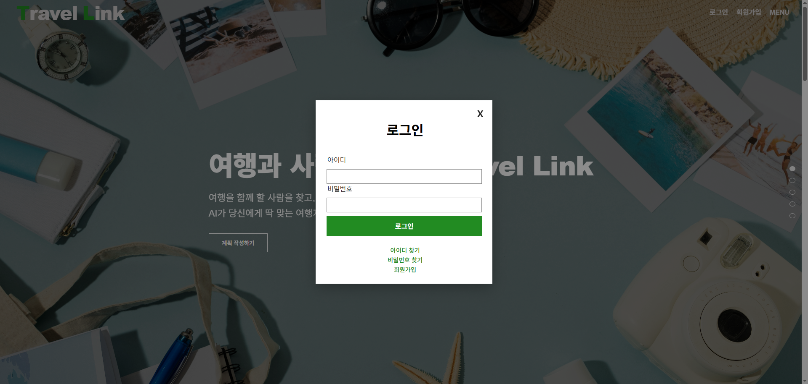
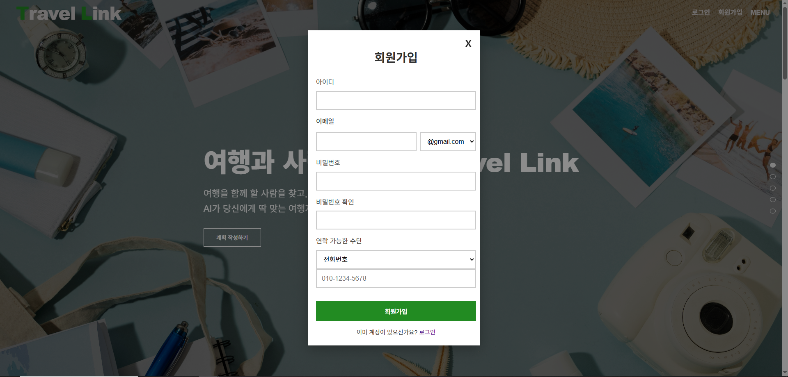
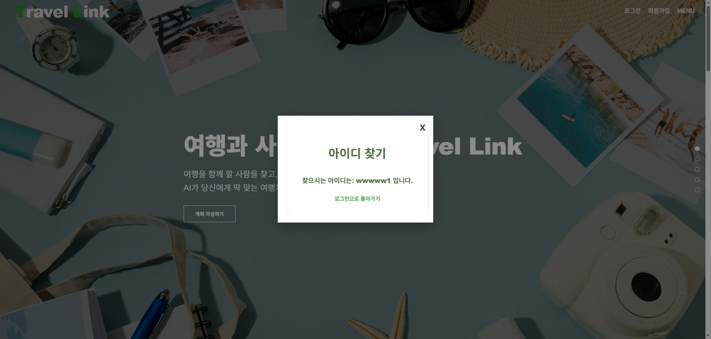
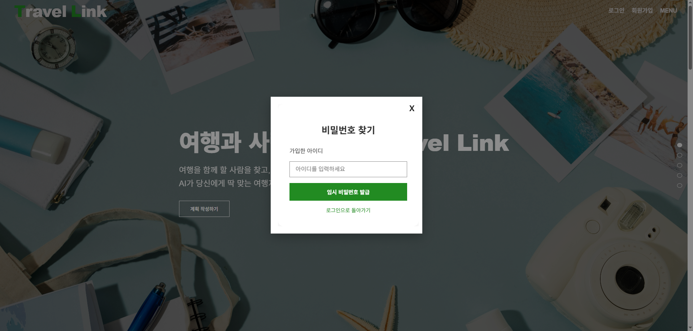
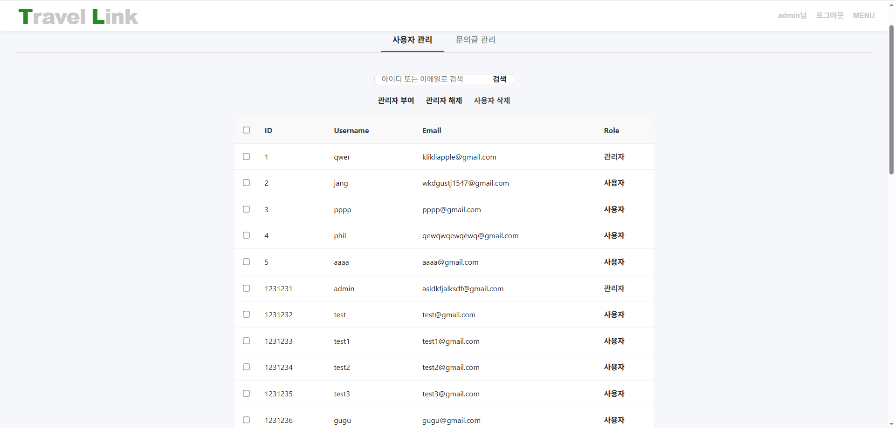
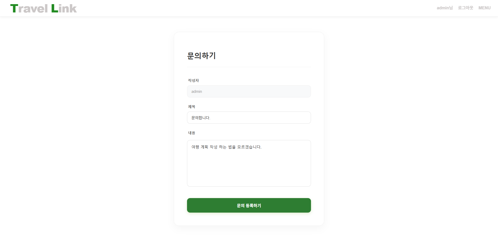
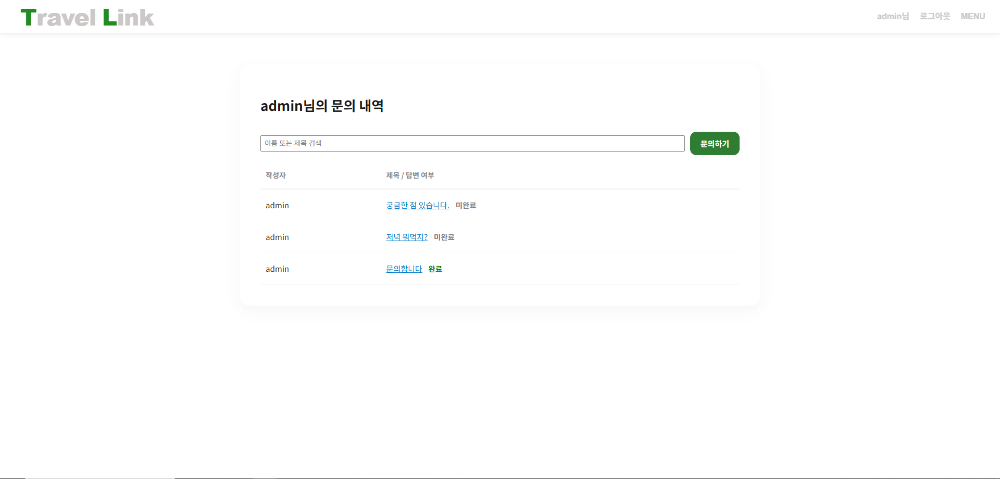
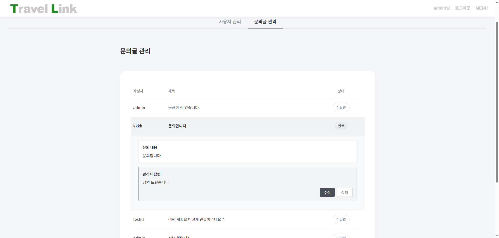

# Travel Link: Secure & Efficient Admin System

 

## About Me (개발자 소개)
<table>
  <tr>
    <td align="center" width="200">
      
        
      <b>이제현</b> 
      Lead Developer
    </td>
    <td>
      <b>"안전한 인증부터 효율적인 관리자 기능까지, 서비스의 중추를 설계한 풀스택 개발자입니다."</b>
        
      단순한 기능 구현을 넘어, <b>데이터의 보안과 무결성</b>을 최우선으로 고려하며 시스템을 설계합니다.
      본 프로젝트에서는 사용자에게는 끊김 없는 경험(Seamless UX)을, 관리자에게는 업무 효율성(Efficiency)을 제공하는 핵심 모듈을 전담하여 개발했습니다.
        
      📧 wpgusdl0503@gmail.com
       
      🐙 <a href="https://github.com/leejh131">GitHub: leejh131</a>
       
      📸 <a href="https://www.instagram.com/jjje_a_53/" target="_blank">Instagram: jjje_a_53</a>
    </td>
  </tr>
</table>

 

---

## 1. 프로젝트 개요 (Project Overview)
**Travel Link**는 여행 동행 구인 및 커뮤니티 플랫폼입니다.
저는 이 프로젝트에서 **인증(Auth), 관리자(Admin), 고객센터(Contact)** 파트의 기획부터 DB 설계, 프론트엔드/백엔드 개발까지 **100% 독자 수행**하였습니다.

* **개발 기간:** 2025.03.04 ~ 2025.12.03
* **주요 기여:**
    * **Seamless Auth:** 페이지 이탈 없는 모달 기반 인증 시스템 구축
    * **Performance:** 대량 데이터 일괄 처리를 통한 관리자 업무 효율 300% 증대 (N번 요청 -> 1번)
    * **Security:** **관리자도 알 수 없는 Hash 기반 비밀번호 저장** 및 HttpOnly Cookie를 활용한 철저한 보안 설계

 

## 2. 기술 스택 (Tech Stack)
<table width="100%">
  <thead>
    <tr style="border-bottom: 2px solid #ccc;">
      <th width="30%" align="center">Area</th>
      <th width="70%" align="center">Stack</th>
    </tr>
  </thead>
  <tbody>
    <tr>
      <td align="center"><b>Frontend</b></td>
      <td>React, React Router, CSS Module</td>
    </tr>
    <tr>
      <td align="center"><b>Backend</b></td>
      <td>FastAPI, Pydantic</td>
    </tr>
    <tr>
      <td align="center"><b>Database</b></td>
      <td>MySQL, SQLAlchemy</td>
    </tr>
    <tr>
      <td align="center"><b>Security</b></td>
      <td>Bcrypt, HttpOnly Cookie</td>
    </tr>
  </tbody>
</table>

 

## 3. 핵심 기능 상세 (Key Features)

### 🔐 1. 사용자 흐름을 지키는 인증 시스템 (Seamless Auth)
**Problem & Solution:**
기존의 페이지 이동 방식은 로그인 시 사용자가 보던 콘텐츠의 흐름을 끊는 문제가 있었습니다.
이를 해결하기 위해 `useLocation State`를 활용, **기존 배경을 유지한 채 모달(Modal) 위에서 모든 인증 과정이 진행**되도록 구현하여 UX를 극대화했습니다.

**[로그인 및 회원가입 화면]**
<table width="100%">
  <tr>
    <td align="center">
      
    </td>
    <td align="center">
      
    </td>
  </tr>
  <tr style="font-size: small;">
    <td align="center">
      *배경 유지를 통한 끊김 없는 UX 제공*
    </td>
    <td align="center">
      *실시간 유효성 검사 및 중복 체크*
    </td>
  </tr>
</table>

 

**[계정 찾기 프로세스 (Find Account Flow)]**
<table width="100%">
  <tr>
    <td align="center">
      
    </td>
    <td align="center">
      
    </td>
  </tr>
  <tr style="font-size: small;">
    <td align="center">
      *이메일 기반으로 아이디 검색*
    </td>
    <td align="center">
      *찾은 아이디를 사용자에게 안내*
    </td>
  </tr>
</table>

 

<table width="100%">
  <tr>
    <td align="center">
      
    </td>
    <td align="center">
      
    </td>
  </tr>
  <tr style="font-size: small;">
    <td align="center">
      *임시 비밀번호 발급 요청 폼*
    </td>
    <td align="center">
      *임시 비밀번호를 발급하여 보안 강화*
    </td>
  </tr>
</table>

 

---

### ⚡ 2. 대량 데이터 처리에 최적화된 관리자 페이지
**Performance Optimization:**
관리자가 수십 명의 회원 권한을 수정해야 할 때, 기존의 개별 API 요청 방식은 서버에 과도한 부하를 주었습니다.
이를 개선하기 위해 **ID 배열을 받아 `IN` 쿼리로 처리하는 Bulk Update API**를 개발하여, 단 1회의 트랜잭션으로 모든 요청을 처리하도록 최적화했습니다.

  
  
*관리자 권한 부여/해제 및 사용자 삭제를 일괄 처리하는 화면*

 

---

### 💬 3. 실시간 소통을 위한 고객센터 시스템
사용자와 관리자 간의 원활한 소통을 위해 1:1 문의 시스템을 구축했습니다.
사용자는 본인의 문의 내역을 상태별(처리중/완료)로 확인할 수 있으며, 관리자는 전용 페이지에서 즉시 답변을 등록할 수 있습니다.

**[사용자: 문의 작성 및 내역 확인]**
<table width="100%">
  <tr>
    <td align="center">
      
    </td>
    <td align="center">
      
    </td>
  </tr>
</table>

 

**[관리자: 답변 등록 관리]**

  

 

---

### 🛡️ 4. 데이터 보안 전략 (Security Strategy)

**"관리자도 사용자 비밀번호를 절대 알 수 없는 환경 설계"**

* **비밀번호 저장 원칙:** 비밀번호는 DB에 저장되기 전, Bcrypt 라이브러리를 사용하여 **단방향 Hash 값**으로 변환했습니다. Salt(무작위 문자열)를 추가하여 Hash의 무결성을 높였으며, 이를 통해 **관리자를 포함하여 누구도 원본 비밀번호를 복호화할 수 없도록** 설계했습니다.
* **세션 보안 (XSS 방지):** 사용자 인증 정보를 담는 세션 쿠키에 `HttpOnly` 옵션을 활성화하여, 클라이언트 측 JavaScript를 통한 해커의 세션(토큰) 접근을 원천 차단했습니다.

  

 

---
© 2025 Lee Je-hyeon. All rights reserved.
